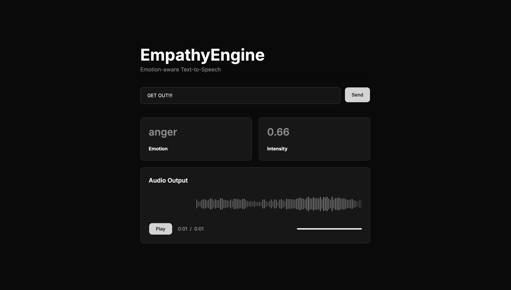

## EmpathyEngine

EmpathyEngine is an emotion-aware text-to-speech (TTS) service. It detects nuanced emotions in text, maps them to vocal parameters such as rate, pitch, volume, and pauses, and then synthesizes expressive audio via a TTS backend (e.g. ElevenLabs).




### Features
- **Multi-label emotion detection** using a RoBERTa-based model (28 emotions).
- **Context-enhanced NLP** with spaCy (NER, intensifiers, contrastive conjunctions, etc.).
- **Emotion intensity scaling** based on punctuation, capitalization, adverbs, and model confidence.
- **Vocal parameter modulation**: rate, pitch, volume, pauses, emphasis, and support for mixed emotions.
- **SSML generation** to precisely control prosody and emphasis.
- **TTS backend integration** (planned: ElevenLabs) for highly expressive voices.
- **Vector DB context cache** (FAISS) for emotional context across requests and conversations.
- **FastAPI REST API** for programmatic access, plus room for a CLI for debugging.

### High-level architecture

1. **Input layer**: FastAPI endpoint accepting text (and optional session/voice hints).
2. **Emotion pipeline**: RoBERTa-based emotion detection + spaCy-based context analysis.
3. **Vocal parameter modulation**: map emotions to vocal parameters and scale based on intensity.
4. **TTS synthesis**: use a TTS backend to render the audio, leveraging SSML where possible.
5. **Vector DB**: FAISS index storing text, emotions, and voice parameters for context reuse.

### Getting started
```zsh
git clone --recurse-submodules https://github.com/vansh2308/EmpathyEngine.git
```
1. Create and activate a Python 3.11+ virtual environment.
2. Copy your environment file and fill in keys: 
- `EMPATHY_ENV` (e.g. `development`)
- `EMPATHY_LOG_LEVEL` (e.g. `INFO`)
- `EMPATHY_ELEVENLABS_API_KEY` (required for real audio)
- `EMPATHY_ELEVENLABS_DEFAULT_VOICE_ID` (your default ElevenLabs voice)

3. Install dependencies with Poetry:

```bash
poetry lock
poetry install
poetry run python -m spacy download en_core_web_sm
```

4. Run the API:

```bash
poetry run uvicorn empathy_engine.api.main:app --reload
```

5. Run demo examples:
```zsh
poetry run python demos/demo_walkthroughs.py
```


5. Access web client:

```bash
cd ./client
npm i
npm run dev
```

### Project layout

- `empathy_engine/`
  - `api/` – FastAPI app, routes, and schemas.
  - `config/` – configuration via Pydantic settings.
  - `nlp/` – emotion model, spaCy helpers, intensity, sarcasm, segmentation.
  - `voice/` – vocal parameter models, blending, SSML, TTS client.
  - `context/` – FAISS vector store, embeddings, conversation context.
  - `pipeline/` – orchestration from text to audio.
  - `utils/` – logging, errors, timing, and general helpers.
- `client/` - Frontend for Web interface

### Author
- Github - [vansh2308](https://github.com/vansh2308)